# PetLove
Welcome to my simple Android Application called PetLove! In this pet-themed application you can discover different veterinaries, dog parks and profile of pets. 

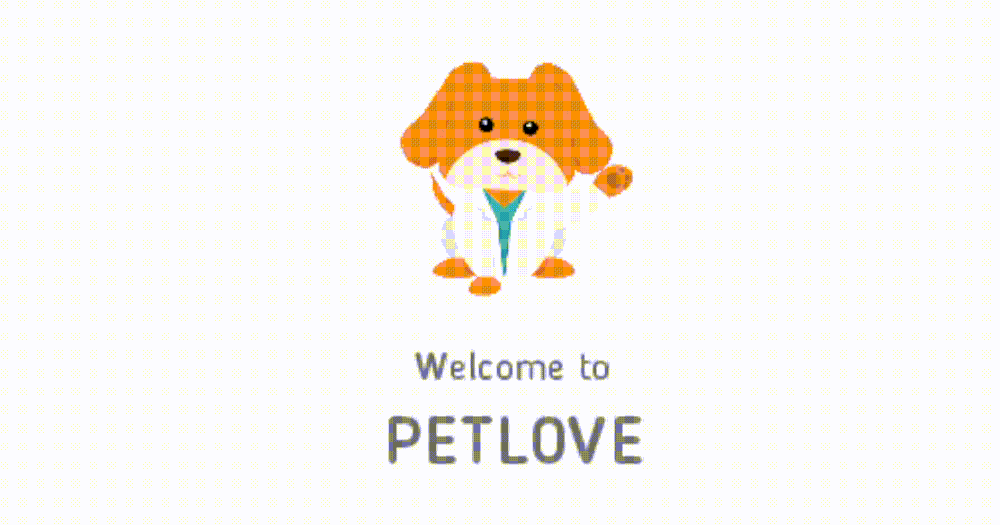

This project was made in collaboration with my colleague Bayram Yasar! We developed PetLove as part of our Android Operating System study.

PetLove, is small proof-of-concept project. It's promise is to be the Instagram for pets. People can register into our app, discover veterinaries, make appoinments and share posts about their post like a typical social media.

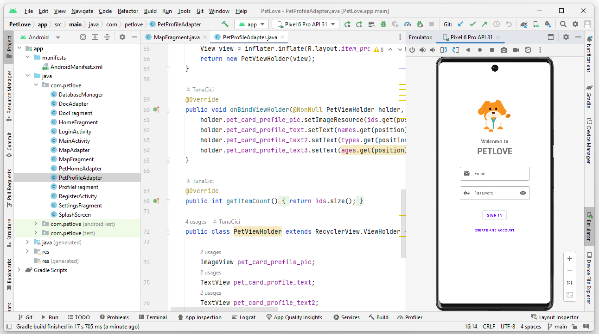

Because this project is a proof-of-concept, it is half-complete. I have no plans to continue working on it. However, I wanted to share this with the public, so that others can explore and learn from it.

# The Design
PetLove has an extremely simple interface. I have tried to follow Google's Material Design, as there was many resources about it on the Internet.

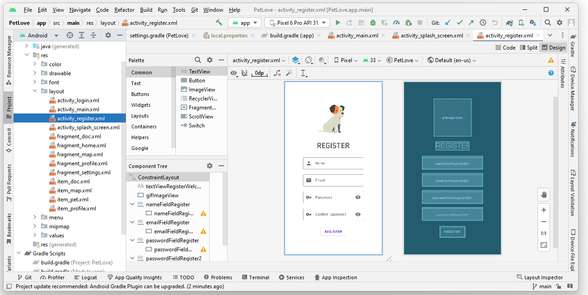

Most of the elements are pet-themed. The login/signup activities has GIFs that welcomes you to the application. You can navigate between different activities using the navigation bar.

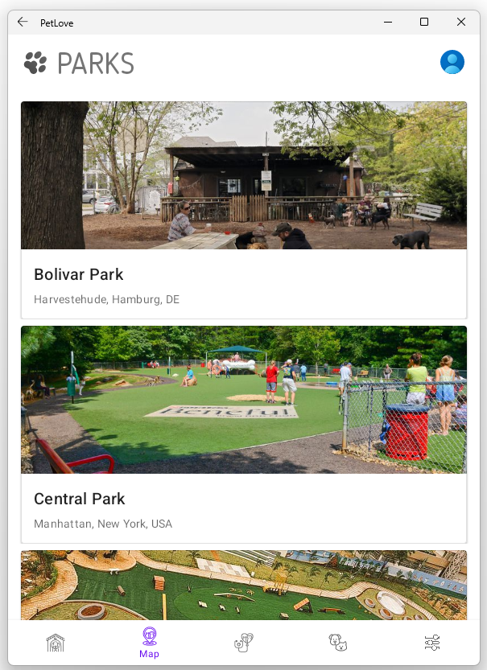

The overall experience is a bit too simple and there is not much to do. Every element (such as veterinaries, dog parks and pets) are static, as this project is only a proof-of-concept.

# The Technology
There is nothing special about the technologies used in PetLove. I have developed it using Android Studio with Android SDK for version 12.0 (API level 31).

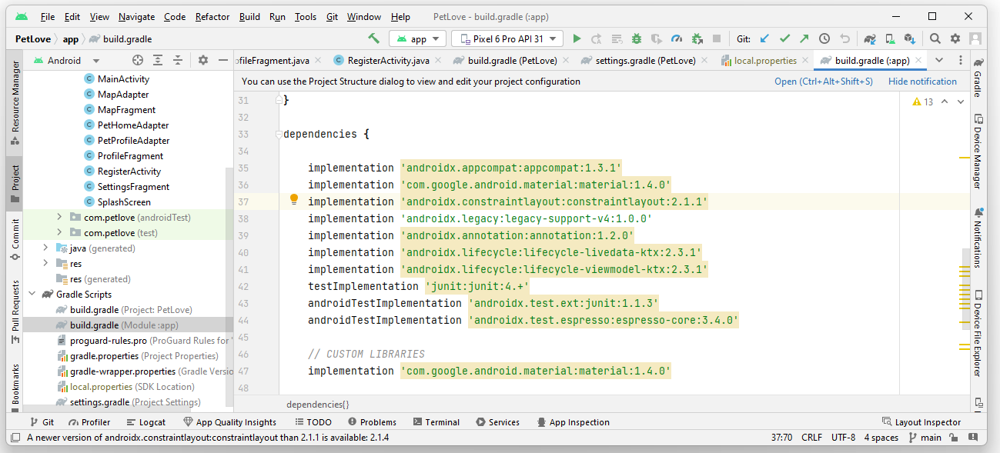

All user-related data and activity elements are stored inside a simple SQLite3 database. You can actually see the .db file inside the Android filesystem.

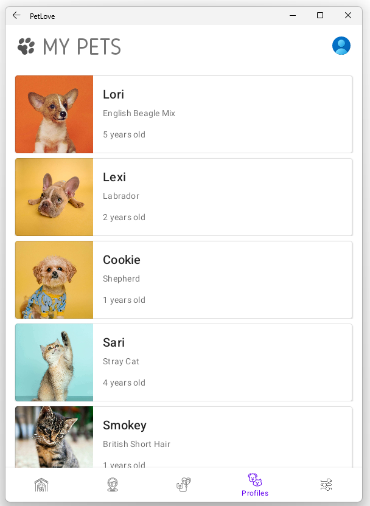

The registered users' password is decrypted and stored inside SQLite database. The session management is also done via SQLite and are stored inside tables.

There are of course many packages this project depends on. Gradle is used to manage these dependicies.

# Installation
Let's learn how to install, build and run PetLove! You can skip to first two sections and install the '.apk' file on to your device.

Note: This guide is for the Windows operating systems. However, you can use it for macOS systems too without much divorgence.

## **Requirements**
PetLove is developed using the Android Studio IDE. So, we need to download and install it.

```console
# Download the .exe from the below link
https://developer.android.com/studio


# Open the installer and follow the instructions there. You can also read the offical installation guide from the below link
https://developer.android.com/studio/install

```

By default, the Android Studio will install the latest Android SDK available. PetLove, uses Android SDK for version 12.0, or in other words **API Level 31**. We need to install the required SDK from the IDE.

```console
# You can simple follow the official guide from the below link
https://developer.android.com/about/versions/12/setup-sdk
```

## **Build**
Now that we have Android Studio and our SDK installed, we can open up this project and start building.

Clone this repository.
```console
$ git clone --depth 1 https://github.com/TunaCici/PetLove.git
```

Launch Android Studio and open up the project.
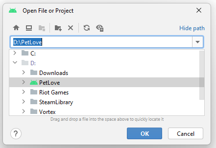

During the launch, Android Studio will index the projet files and setup Gradle dependicies. You don't have to do anything except for waiting.

The launch process can take a few minutes depending on your machine. Android Studio is painfully slow :(

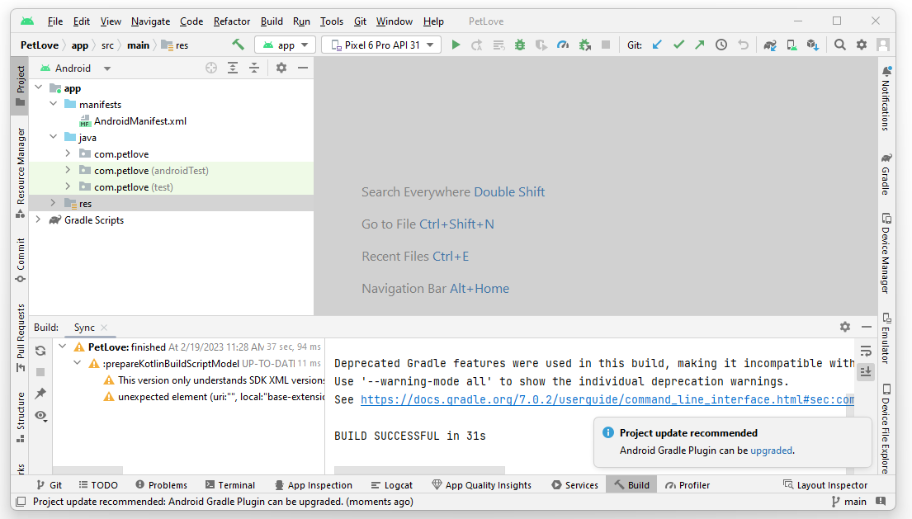

After everything is succesfully launched, you can start building the application. Click the build icon or press **CTRL + F9** to start building.


Again, this process can take a few minutes depending on your machine.

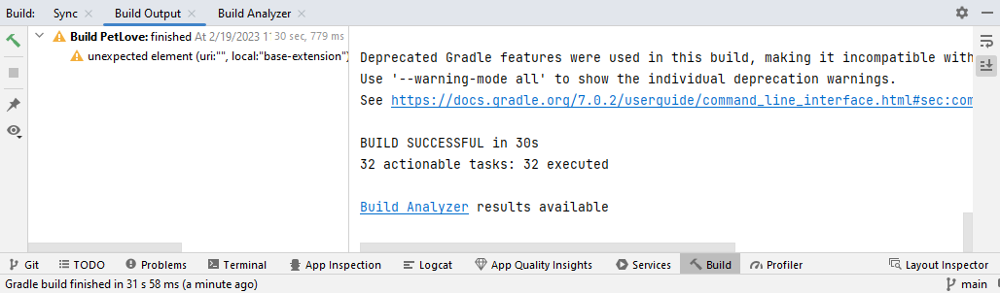

The build is successfull! You can find the '.apk' file inside the folder *app/build/outputs/apk/debug/*. The PetLove is now ready to be installed.

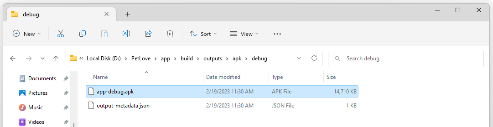

## **Run**
There are many different ways you can install and run the PetLove '.apk' file. I will show three ways that I have used personally.

### **Windows Subsystem for Android™️**
This is a rather new method. If you have the latest version of Windows 11, you can use what is known as Windows Subsystem For Android™️ (WSA™️) to install Android application directly into the Windows.

First, you need to install WSA™️ onto your Windows machine. However, I will not be personally explaining how to install it. There are many great articles on the Internet.
```console
# You can follow this amazing article to install WSA™️
https://www.androidpolice.com/set-up-wsa-windows-11-android-apps/
```

After you have installed WSA™️, we need to it's Developer settings. Doing this is going to allow us to install PetLove '.apk' file using the Android Debugger (adb.exe).

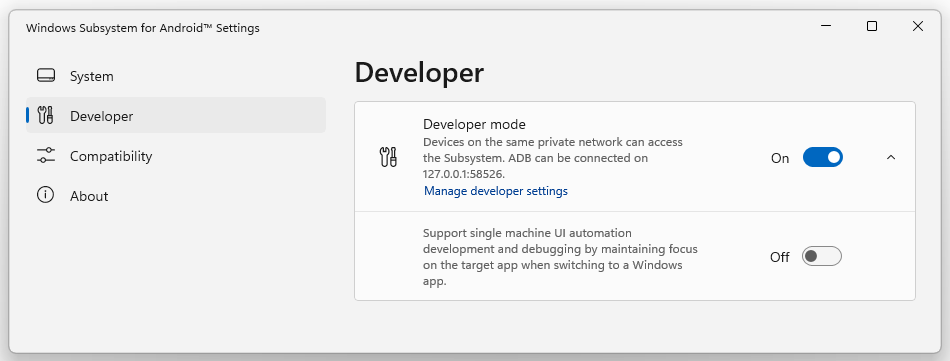

Note the IP address and the port shown on this screen. Later, we will use it to connect to WSA™️.

The tool called 'adb' is used to debug Android OS and it's applications. We can use it to install/uninstall all kinds of things.
```console
# Download the 'SDK Platform-Tools for Windows' from the link below
https://developer.android.com/studio/releases/platform-tools

# The '.zip' file contains the 'adb.exe' we want
# Extract it to a folder of your choosing (I use 'C:/adb')
```

Now that we have WSA™️ (/w Developer Mode) and 'adb.exe'. We can install the PetLove '.apk' file. Open up a cmd/powershell console inside the folder tha the 'adb.exe' is in.
```console
# Connect to WSA™️
$ ./adb.exe connect 127.0.0.1:58526
> connected to 127.0.0.1:58526

# Check if connected
$ ./adb.exe devices
> List of devices attached
> 127.0.0.1:58526 device
```

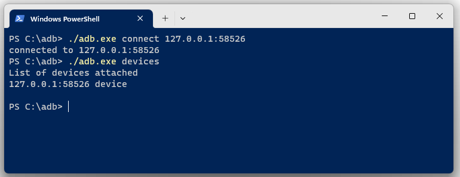

Install the PetLove '.apk'
```console
# Connect to WSA™️
$ ./adb.exe install "<THE_APK_FILE_LOCATION>"
```

After the installation process. You can see the PetLove show up on your Windows applications. Search for 'petlove' and see that it is installed successfully.

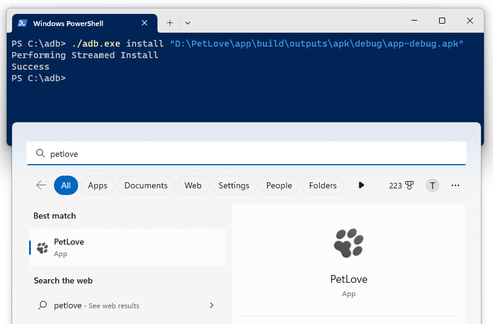

### **Android Virtual Device**
Another and more fledged way to run PetLove is to just use Android Studio's built-in virtual device manager.

Create a virtual Android device. Make sure to use at least version Android Version 12.0.

### **Your Android Phone**
You can also install the PetLove '.apk' file onto your own Android device. However, it requires you to enable 'Install unkown apps' option on your device.
```console
# You can follow this amazing guide by Android Authority to install '.apk' files on your Android device
https://www.androidauthority.com/how-to-install-apks-31494/
```

# Usage
You can launch the PetLove after you installed it using one of the above methods. The first screen is a basic login/signup activity where you can create a new account.

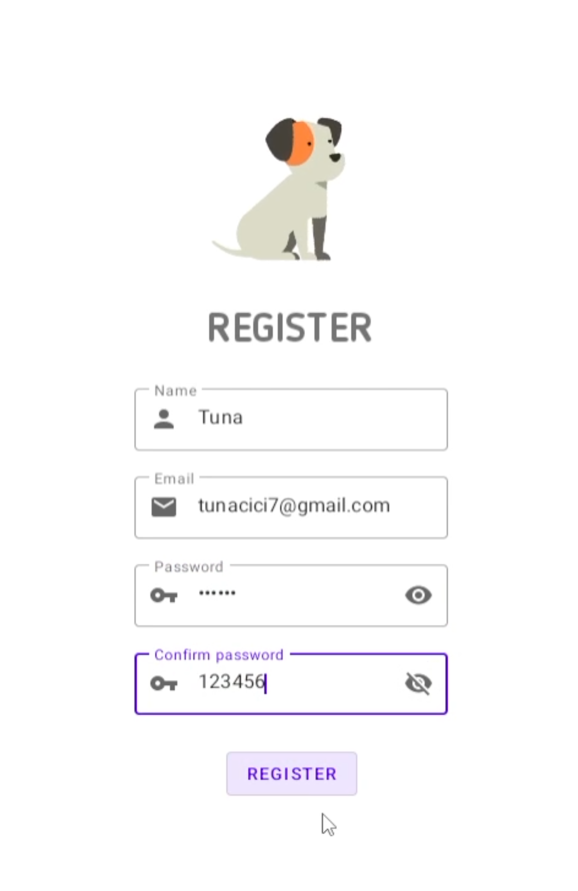

After you have logged in, you can navigate between different activities.

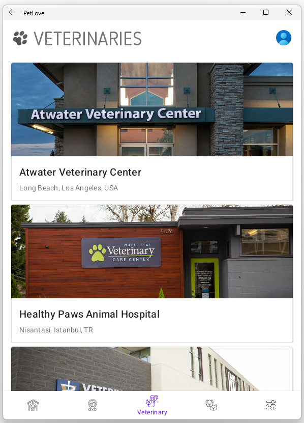

The right-most activity, TODO, is where you can sign out from your account. There is also a button that sends a simple notification. It is nothing big, just a simple notification >.<

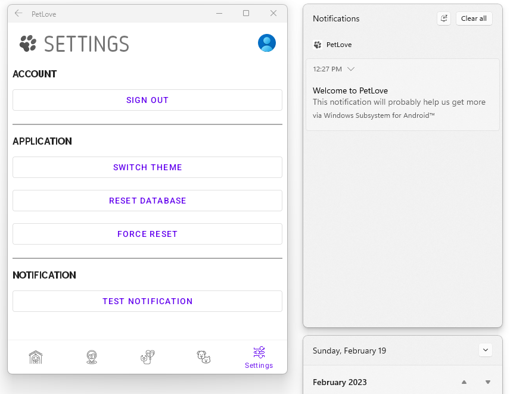

# Explore!
So far, I have showed how to open this project, build it and run it via different methods. However, you should explore it on your own! The project is open source and you can do whatever you want with it.

Feel free to contact me, if you have any questions. I will try to help you in anyway I can!